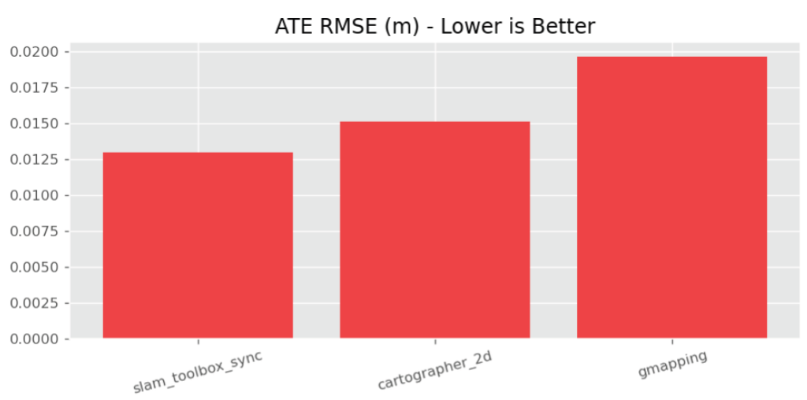
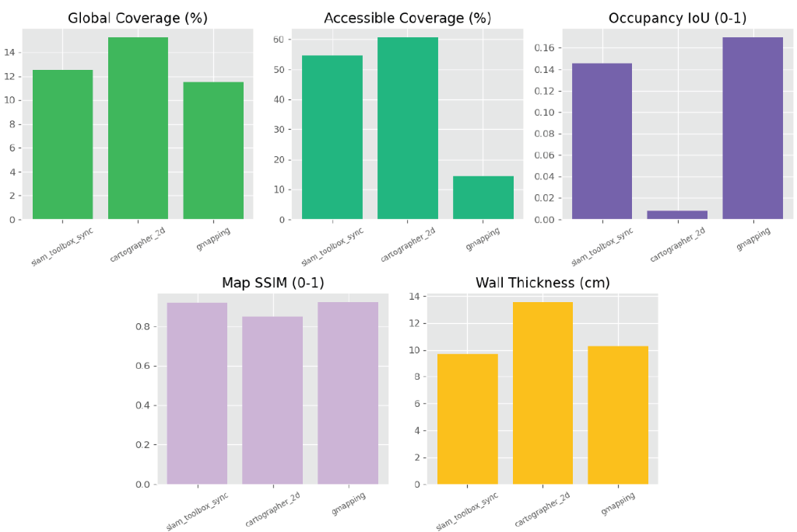
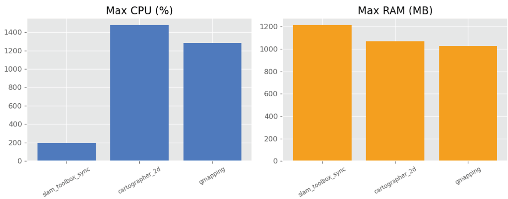
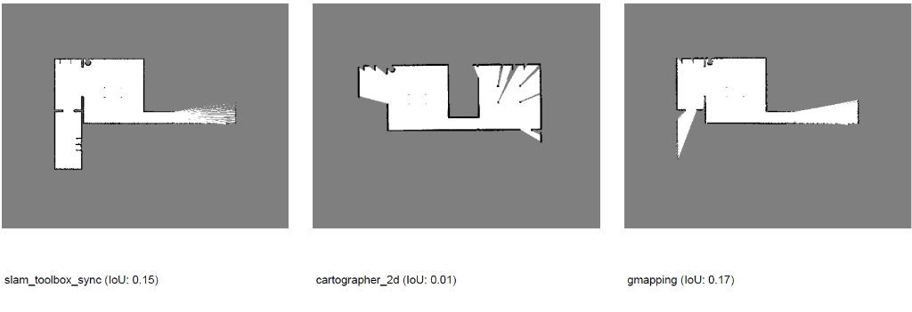

<p align="center">
  
</p>

# BenchBot

<p align="center">
  <a href="https://benchbot.guillaumeschneider.fr">
    
  </a>
  
  
  
</p>

<p align="center">
  <strong>The Comprehensive Ecosystem for ROS 2 Navigation & SLAM Benchmarking</strong>
</p>

---

## 💡 What is BenchBot?

**BenchBot** is a complete lifecycle ecosystem for professional ROS 2 development. From initial integration to final validation, it empowers teams to master their navigation stack.

*   **🧩 Integrate**: Plug in any SLAM algorithm ([Cartographer](https://github.com/ros2/cartographer), [SLAM Toolbox](https://github.com/SteveMacenski/slam_toolbox), [GMapping](https://github.com/ros-perception/slam_gmapping)) with a modular plugin system.
*   **⚙️ Optimize**: Use the **AI Auto-Tuner** to automatically discover the perfect parameters for your robot.
*   **📈 Monitor**: Track evolution with industrial-grade metrics (**ATE**, **SSIM**, **Coverage**) over time.
*   **✅ Validate**: Ensure production readiness with automated CI/CD pipelines and reproducible Docker environments.

---

## 🚀 Key Features

*   **Multi-Simulator**: Switch between **Gazebo** (Classic) and **O3DE** (PhysX 5.0).
*   **High-Fidelity Physics**: "Sim-to-Real" tuning with realistic wheel slip, friction, and IMU/Lidar noise ([Details](https://benchbot.guillaumeschneider.fr/SIMULATION_REALISM/)).
*   **Advanced Metrics**:
    *   **Trajectory**: ATE (Absolute Trajectory Error) with automatic alignment
    *   **Map Quality**: Coverage %, IoU, **SSIM (Structural Similarity)**, Wall Thickness Analysis
    *   **System**: Real-time CPU Usage %, Max RAM (MB)
    *   **Anomaly Detection**: Stuck robot, TF jumps, massive drift detection
*   **Docker Support**: Full containerization for 100% reproducible benchmarks across environments
*   **Automated Reporting**: One-click PDF generation with trajectory plots, metrics tables, and health indicators
*   **Centralized Logging**: Rotating file logs, colored console output, automatic crash reports (JSON)
*   **Comprehensive Testing**: 70+ unit tests with pytest, 80%+ code coverage, CI/CD ready
*   **Headless CI**: Run full benchmarks on servers without a display (`runner/run_matrix.py`).
*   **Modern GUI**: Dashboard, Analysis Comparison, 3D Visualizer, Robot Manager, and Settings.
*   **Intelligent Comparison**: Overlay up to 3 trajectories with ground truth and detailed anomaly tooltips.
*   **3D Real-Time Monitoring**: Live LIDAR point cloud, robot pose, and trajectory with "Follow Robot" camera mode.
*   **Stress Testing**: Dynamic sensor degradation (LIDAR noise/range) and actuator limiting.

---

## 🏆 Benchmark Results Showcase

**See the full [Demo Report](https://benchbot.guillaumeschneider.fr/Demo/Report/) for interactive analysis.**

Here is a sample comparison between **[SLAM Toolbox](https://github.com/SteveMacenski/slam_toolbox)**, **[Cartographer](https://github.com/ros2/cartographer)**, and **[GMapping](https://github.com/ros-perception/slam_gmapping)** in a simulated office environment.

### 📊 Performance Summary

| Metric | [SLAM Toolbox](https://github.com/SteveMacenski/slam_toolbox) | [Cartographer](https://github.com/ros2/cartographer) | [GMapping](https://github.com/ros-perception/slam_gmapping) |
| :--- | :---: | :---: | :---: |
| **ATE RMSE (m)** | **0.0130** 🥇 | 0.0151 🥈 | 0.0197 🥉 |
| **Map SSIM** | 0.9175 | 0.8517 | **0.9212** 🥇 |
| **CPU Usage** | **196%** 🥇 | 1476% | 1284% |
| **RAM Usage** | 1212 MB | 1068 MB | **1027 MB** 🥇 |
| **Map IoU** | 0.1457 | 0.0079 | **0.1695** 🥇 |

> **Analysis**: **SLAM Toolbox** offers the best trajectory accuracy (lowest ATE), while **GMapping** produces the highest quality maps (best SSIM & IoU) but consumes significantly more resources. **Cartographer** struggled with loop closure in this specific scenario, resulting in lower map quality scores.

### 📈 Generated Charts & Maps

<p align="center">
  
  
</p>

<p align="center">
  
  
</p>


---

## 📖 Documentation

Full documentation is available at **[https://benchbot.guillaumeschneider.fr](https://benchbot.guillaumeschneider.fr)**.

### Quick Links
*   [🚀 Quick Start](https://benchbot.guillaumeschneider.fr/QUICK_START/)
*   [📦 Installation Guide](https://benchbot.guillaumeschneider.fr/INSTALLATION/)
*   [📊 Metrics Explained](https://benchbot.guillaumeschneider.fr/METRICS/)
*   [🎮 Simulators (Gazebo vs O3DE)](https://benchbot.guillaumeschneider.fr/SIMULATORS/)
*   [🧠 AI Auto-Tuner](https://benchbot.guillaumeschneider.fr/AUTO_TUNER_GUIDE/)
*   [🖥️ Headless Mode (CI/CD)](https://benchbot.guillaumeschneider.fr/HEADLESS_CI/)

---

## 📦 Installation

### Prerequisites
*   **OS**: Ubuntu 22.04 LTS
*   **ROS 2**: Humble Hawksbill
*   **Python**: 3.10+

### Quick Install
```bash
# Clone the repository
git clone https://github.com/guillaume-schneider/BenchBot.git
cd BenchBot

# Run automated installer
./install.sh
```

For detailed instructions, see the [Installation Guide](https://benchbot.guillaumeschneider.fr/INSTALLATION/).

---

## 🤝 Contributing

We welcome contributions! Please see our [Contributing Guide](https://benchbot.guillaumeschneider.fr/CONTRIBUTING/) for details.

## 📜 License

This project is licensed under the MIT License - see the [LICENSE](LICENSE) file for details.
