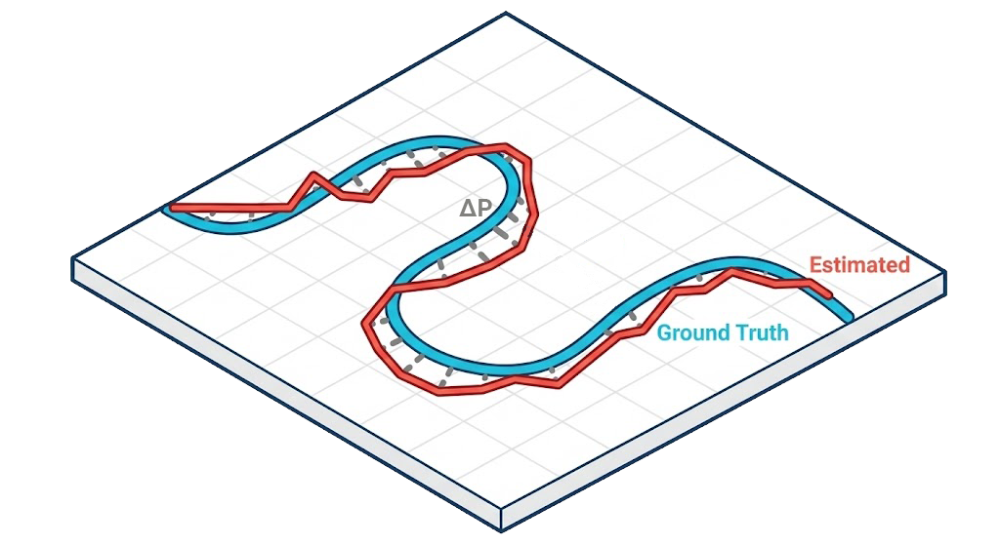
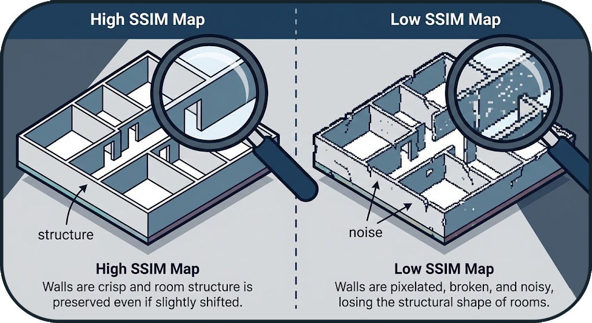
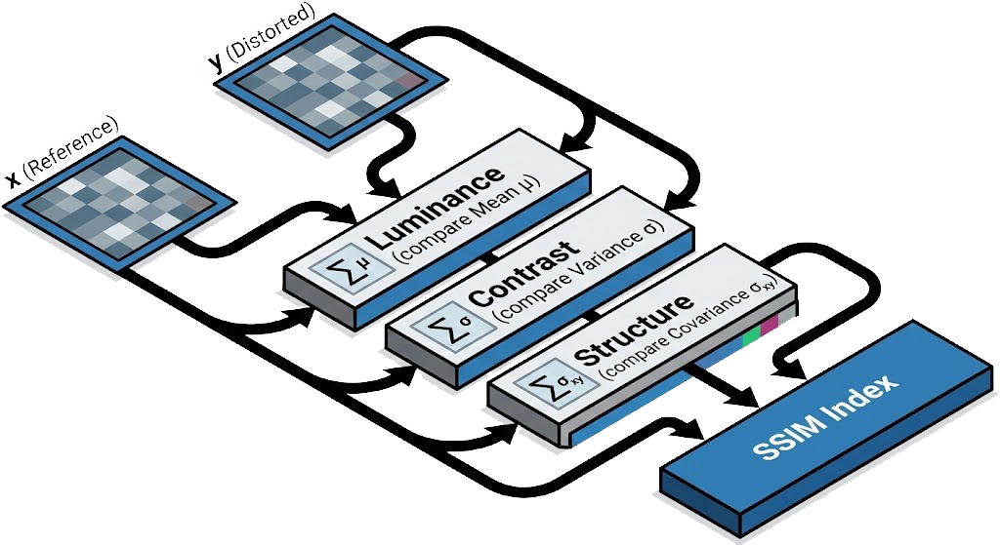
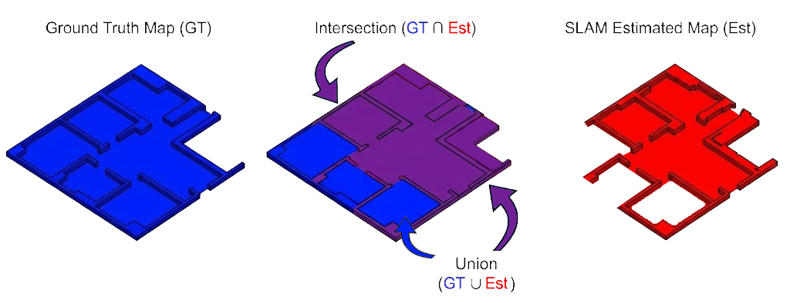
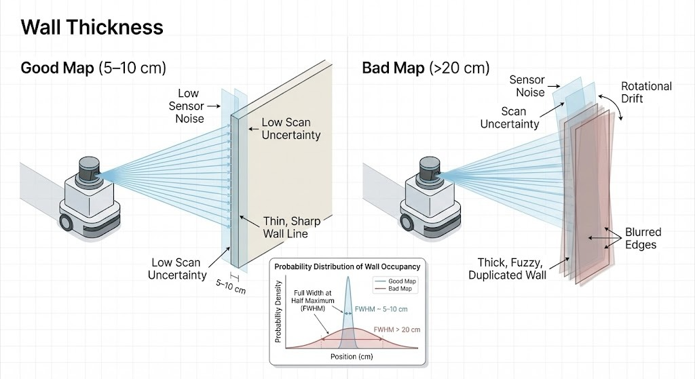

# 📊 Metrics Explained

BenchBot evaluates SLAM performance using 5 key metrics. This guide explains what each metric means for your robot's performance, with options to dive deep into the mathematical details.

## 🎯 1. ATE (Absolute Trajectory Error)

**What it measures:**  
This is the most important metric for **localization accuracy**. It tells you, on average, how far off the robot's estimated position is from its actual physical location.

**Intuitive Understanding:**  
Imagine drawing the path the robot *actually* took in blue, and the path the robot *thought* it took in red. The ATE calculates the average gap between these two lines.

*   **Low ATE**: The robot knows exactly where it is.
*   **High ATE**: The robot is lost or drifting.

??? abstract "Deep Dive: Math & Algorithm"
    

    **Mathematical Definition**
    Given the estimated trajectory sequence $\mathbf{P}_{est} = \{ \mathbf{p}_1, \dots, \mathbf{p}_N \}$ and the ground truth sequence $\mathbf{P}_{gt} = \{ \mathbf{q}_1, \dots, \mathbf{q}_N \}$, we first align them using a rigid transformation $\mathbf{T}$ (rotation $\mathbf{R}$ and translation $\mathbf{t}$) that minimizes the least squares error (typically via the **Umeyama algorithm**):

    $$ \min_{\mathbf{R}, \mathbf{t}} \sum_{i=1}^{N} \| \mathbf{p}_i - (\mathbf{R}\mathbf{q}_i + \mathbf{t}) \|^2 $$

    The ATE (specifically, the RMSE - Root Mean Square Error) is then calculated as:

    $$ \text{ATE}_{rmse} = \sqrt{\frac{1}{N} \sum_{i=1}^{N} \| \text{trans}(\mathbf{p}_i) - \text{trans}(\mathbf{T}\mathbf{q}_i) \|^2} $$

    Where $\| \cdot \|$ denotes the Euclidean norm.

| Value | Interpretation | Rating |
| :--- | :--- | :--- |
| **< 0.05m** | Extremely Precise (Sub-5cm accuracy) | ⭐⭐⭐⭐⭐ |
| **< 0.15m** | Good for Indoor Navigation | ⭐⭐⭐⭐ |
| **> 0.50m** | Significant Drift / Localization Failure | ❌ |

---

## 🗺️ 2. Map Quality (SSIM & IoU)

These metrics answer the question: **"Did the robot build a good map?"**

### SSIM (Structural Similarity)
**What it measures:**  
How "correct" the map looks to a human eye. It checks if walls are straight, corners are sharp, and room layouts are preserved.

**Intuitive Understanding:**  

If you took a photo of the real floor plan and the robot's map, SSIM measures how similar they look in terms of structure. A map can be slightly shifted (bad localization) but still have a perfect Room layout (High SSIM).

??? abstract "Deep Dive: Math & Algorithm"
    

    **SSIM Formula**
    It combines **Luminance (l)**, **Contrast (c)**, and **Structure (s)**:

    $$ \text{SSIM}(x, y) = \frac{(2\mu_x\mu_y + C_1)(2\sigma_{xy} + C_2)}{(\mu_x^2 + \mu_y^2 + C_1)(\sigma_x^2 + \sigma_y^2 + C_2)} $$

    Where:

    *   $\mu_x, \mu_y$: Local means (average occupancy probability).
    *   $\sigma_x, \sigma_y$: Local variances (texture/noise).
    *   $\sigma_{xy}$: Cross-covariance.
    *   $C_1, C_2$: Constants to stabilize division.

### IoU (Intersection over Union)
**What it measures:**  
The precise overlap between reality and the map.

**Intuitive Understanding:**  
Think of "coloring inside the lines."

*   **Intersection**: Areas where the robot *correctly* marked a wall.
*   **Union**: The total area of walls in both the real world and the robot's map.
If the robot creates "ghost walls" or misses real walls, the IoU score drops.

??? abstract "Deep Dive: Math & Algorithm"
    

    **Jaccard Index Definition**

    $$ \text{IoU} = \frac{| A \cap B |}{| A \cup B |} = \frac{\text{True Positives}}{\text{True Positives} + \text{False Positives} + \text{False Negatives}} $$

    *   **A**: Set of occupied pixels in the SLAM map.
    *   **B**: Set of occupied pixels in the Ground Truth map.

| Value | Interpretation |
| :--- | :--- |
| **1.0** | Perfect Replica |
| **> 0.85** | High Fidelity |
| **< 0.60** | Distorted / Incomplete Map |

---

## 🧱 3. Wall Thickness

**What it measures:**  
Sharpness of the map. It detects sensor noise and "double wall" effects.

**Intuitive Understanding:**  
In real life, a wall is solid and thin.

*   **Good Map**: Walls look like thin, sharp lines (e.g., 5-10cm).
*   **Bad Map**: Walls look like thick, fuzzy markers or appear as two parallel lines (Double Wall). This happens when the robot is slightly confused about its rotation.

??? abstract "Deep Dive: Math & Algorithm"
    

    **Measurement Algorithm**

    1.  **Edge Detection**: Identify wall edges using a Canny edge detector or gradient magnitude.
    2.  **Orthogonal Scan**: For each wall point, measure the distance to free space on both sides (orthogonal to the wall).
    3.  **FWHM**: Compute the **Full Width at Half Maximum** of the occupancy probability distribution.

    $$ \text{Thickness} = \text{Mean}(\text{Wall Widths}) $$

    *   **Ideal Wall**: ~5-10cm (limited by Lidar noise + Grid resolution).
    *   **Blurred Wall**: > 20cm (indicates "Double Wall" effect or high rotational drift).

---

## 🖥️ 4. System Resources

This metric tracks the computational efficiency of the SLAM algorithm. Unlike accuracy metrics, this measures *cost*: how expensive is it to run this algorithm on the robot?

**CPU Usage (Computational Load)**  
This measures the percentage of the robot's processing power dedicated to SLAM.

*   **Why it matters:** High CPU usage drains the battery faster and can cause the entire system to lag (latency). If the CPU is maxed out (100%), the robot might miss sensor readings or react too slowly to obstacles.
*   **Target:** We aim for **< 50% usage** on a single core to ensure there is plenty of headroom for other tasks like path planning and object detection.

**RAM Usage (Memory Footprint)**  
This measures the peak amount of Random Access Memory (RAM) used by the algorithm.

*   **Why it matters:** If the algorithm uses more memory than available, the system will swap to disk (extremely slow) or crash completely (OOM Kill). Large maps often cause memory spikes.
*   **Target:** We aim to keep peak usage **under 2GB** to remain compatible with standard embedded computers (like Raspberry Pi or Jetson Nano).

