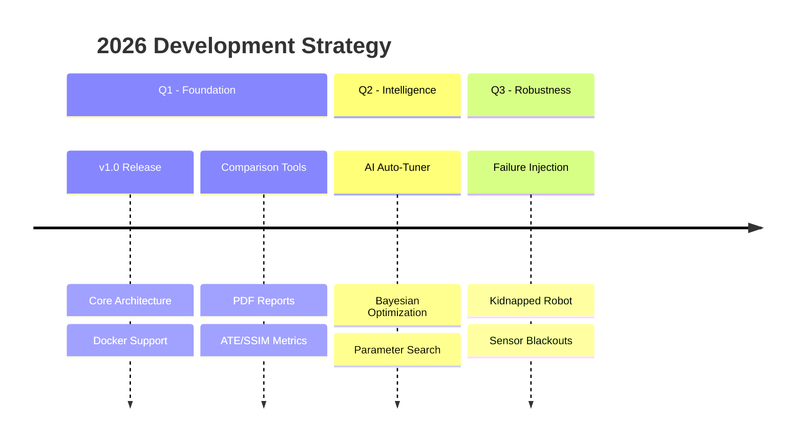

---
hide:
  - navigation
---

# 🚀 Product Roadmap

  <strong>The Future of SLAM Benchmarking</strong>

This roadmap outlines our strategic direction for **BenchBot**, focusing on AI-driven optimization, extreme robustness testing, and enterprise-grade integration.

---

## 📅 Strategic Timeline

---

## 🚧 Development Tracks

=== "🔮 Upcoming (Planned)"

    ### **1. AI Auto-Tuner & Optimization** 🧠
    
    Eliminate manual parameter tuning with our new Bayesian Optimization engine.
    
    !!! note "Target: Q2 2026"
        Automatic discovery of optimal SLAM parameters (particles, update thresholds, resolution) to minimize ATE.

    *   [ ] **Optimization Engine Integration** (Optuna / scikit-optimize)
    *   [ ] **Parameter Space Schema**: Define ranges for any SLAM algorithm in YAML.
    *   [ ] **Visualization Dashboard**: Real-time convergence plots and Pareto frontiers.

    ---

    ### **2. Dynamic Failure Injection** 🧨
    
    Test how your SLAM stack survives the real world.
    
    !!! warning "Target: Q3 2026"
        Simulate catastrophic failures to validate recovery behaviors.

    *   [ ] **Kidnapped Robot**: Teleport robot mid-run to test localization recovery.
    *   [ ] **Sensor Blackout**: Simulate LIDAR/Camera failures in critical zones.
    *   [ ] **Dynamic Obstacles**: Spawn moving agents (pedestrians, forklifts) to test dynamic environment robustness.

    ---

    ### **3. Multi-Robot Support** 🤖🤖
    
    *   [ ] **Map Merging**: Evaluate multi-session mapping quality.
    *   [ ] **Collab SLAM**: Bandwidth-constrained coordination metrics.

=== "🏗️ In Progress"

    ### **Extended Simulator Support** 🎮
    
    Moving beyond Gazebo Classic to support next-gen rendering.

    *   [x] **Gazebo Classic**: Full support.
    *   [ ] **O3DE (Open 3D Engine)**: Experimental support.
        *   [ ] Lidar Raycasting optimization.
        *   [ ] Material physics integration.

    ### **CI/CD Integration** 🔄
    
    *   [x] **Headless Mode**: Run benchmarks via CLI.
    *   [ ] **GitHub Actions**: Automated regression testing workflow.
    *   [ ] **Historical Trending**: Track performance over commits.

=== "✅ Completed (v1.0)"

    !!! success "Foundation Release"
        The core architecture is stable and production-ready.

    *   [x] **Universal Orchestrator**: Run any ROS 2 SLAM (Cartographer, GMapping, SLAM Toolbox).
    *   [x] **Advanced Metrics**: ATE, SSIM, Map Coverage, Wall Thickness.
    *   [x] **Docker Support**: One-click containerization for 100% reproducibility.
    *   [x] **PDF Reporting**: Automated report generation with high-res plots.
    *   [x] **Interactive GUI**: Real-time visualization and control dashboard.

---

## 🗳️ Feature Requests

We value community feedback! If you need a specific feature:

1.  Check the [Issue Tracker](https://github.com/guillaume-schneider/BenchBot/issues) for existing requests.
2.  Open a new **Feature Request** with the label `enhancement`.
3.  Join the discussion on our [GitHub Discussions](https://github.com/guillaume-schneider/BenchBot/discussions).

  <small>Roadmap subject to change based on community priorities.</small>

