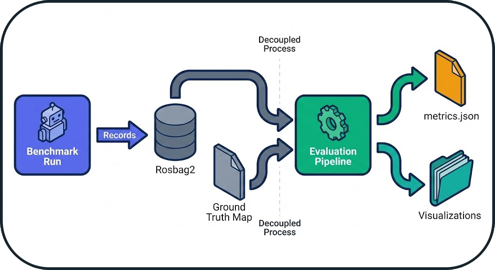
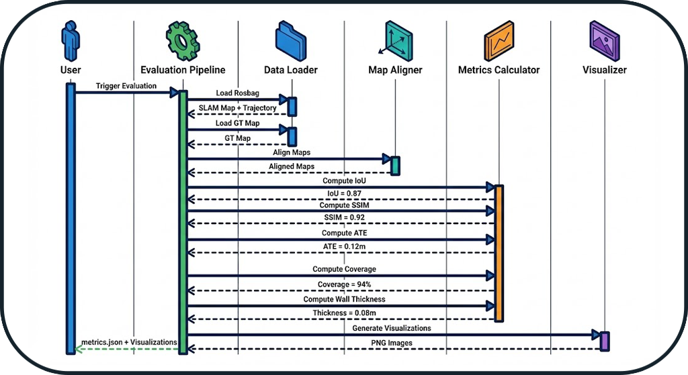

# Evaluation Architecture

**Evaluation** is the pillar that transforms raw benchmark data into quantifiable, actionable metrics. This document describes the architecture of the evaluation system and its design principles.

---

## Overview

### Concept: Post-Execution Pipeline

Evaluation is **decoupled** from execution. It occurs **after** the run is complete, ensuring that the benchmark is not disturbed by expensive calculations.



**Advantage**: The system can evaluate past runs without re-running them.

---

## Pipeline Architecture

### 1. Data Extraction

**Source**: Rosbag2 recorded during the run

**Extracted Data**:
- **SLAM Map**: Topic `/map` (OccupancyGrid)
- **Trajectory**: Topic `/odom` (Odometry)
- **Timestamps**: Temporal synchronization

**Module**: `evaluation.data_loader`

```python
# Conceptual pseudo-code
rosbag = load_rosbag("results/runs/RUN_XXX/rosbag2/")
slam_map = extract_latest_map(rosbag, topic="/map")
trajectory = extract_trajectory(rosbag, topic="/odom")
```

---

### 2. Map Alignment

**Problem**: SLAM algorithms produce maps in arbitrary frames.

**Solution**: Automatic alignment based on the robot's spawn origin.


**Assumption**: The robot starts at a known pose in the GT map (defined in the configuration).

**Transformation**: Translation + Rotation to superimpose origins.

---

### 3. Metrics Calculation

The system calculates **5 complementary metrics** to evaluate different aspects of SLAM quality.

#### Metrics Architecture


#### Design Principles

| Metric | Objective | Principle |
|--------|-----------|-----------|
| **IoU** | Measure **correct coverage** | Intersection / Union of occupied areas |
| **SSIM** | Measure **perceptual quality** | Structural similarity (shapes, contours) |
| **Wall Thickness** | Measure **sharpness** | Average thickness of detected walls |
| **ATE** | Measure **localization precision** | Absolute Trajectory Error |
| **Coverage** | Measure **exploration** | Percentage of free space explored |
| **CPU/RAM** | Measure **performance** | Average resource consumption |

!!! info "Complementarity of Metrics"
    Each metric captures a different aspect:

    - **IoU**: "Did I map the right areas?"
    - **SSIM**: "Are the shapes correct?"
    - **Wall Thickness**: "Are the walls sharp or blurry?"
    - **ATE**: "Is my localization precise?"
    - **Coverage**: "Did I explore the entire space?"
    - **CPU/RAM**: "Is the system lightweight or resource-heavy?"

---

### 4. Visualization Generation

**Objective**: Make metrics visually interpretable.

**Generated Visualizations**:

1. **Overlay Maps**: Superimposed GT (red) + SLAM (green)
2. **Difference Heatmap**: Difference map (errors in red)
3. **Trajectory Plot**: GT vs SLAM trajectory
4. **Coverage Evolution**: Coverage graph over time

**Module**: `evaluation.visualizer`

---

## Architectural Principles

### 1. Separation of Concerns

```
evaluation/
├── data_loader.py      # Rosbag extraction
├── alignment.py        # Map alignment
├── metrics.py          # Metric calculation
├── visualizer.py       # Graph generation
└── report_generator.py # Results aggregation
```

Each module has a **single responsibility** and can be tested independently.

### 2. Reproducibility

**Guarantee**: Two evaluations of the same rosbag produce the same results.

**Mechanism**:
- No randomness
- Fixed parameters (resolution, thresholds)
- Determinism of algorithms

### 3. Extensibility

**Adding a new metric**:

```python
# evaluation/metrics.py
class NewMetric(BaseMetric):
    def compute(self, gt_map, slam_map):
        # Calculation logic
        return score
```

**Registration**:
```python
METRICS_REGISTRY = {
    "iou": IoUMetric(),
    "ssim": SSIMMetric(),
    "new_metric": NewMetric(),  # Addition
}
```

---

## Evaluation Workflow

### Complete Sequence



### Typical Timeline

```
t=0s     : Rosbag loading (5-10s)
t=10s    : SLAM map extraction
t=15s    : Map alignment (1-2s)
t=17s    : Metrics calculation (10-20s)
t=35s    : Visualization generation (5-10s)
t=45s    : Writing metrics.json
```

**Total Duration**: 30-60 seconds (depends on map size)

---

## Edge Case Management

### 1. Empty SLAM Map

**Detection**: No occupied cells in `/map`

**Action**: Metrics set to 0, warning in logs

### 2. Missing GT Map

**Detection**: File `map_gt.pgm` not found

**Action**: Automatic generation from SDF (see [GT Map Generation](tools.md#2-ground-truth-map-generation))

### 3. Extreme Misalignment

**Detection**: IoU < 0.1 after alignment

**Action**: Attempt realignment with ICP (Iterative Closest Point)

### 4. Incomplete Trajectory

**Detection**: Fewer than 10 poses in `/odom`

**Action**: ATE marked as "N/A", warning

---

## Optimizations

### 1. Parallel Calculation

Independent metrics are calculated in **parallel**:

```python
with ThreadPoolExecutor() as executor:
    futures = {
        executor.submit(compute_iou, gt, slam): "iou",
        executor.submit(compute_ssim, gt, slam): "ssim",
        executor.submit(compute_ate, gt_traj, slam_traj): "ate",
    }
```

**Gain**: ~40% reduction in evaluation time

### 2. GT Map Caching

GT maps are **cached** to avoid reloading them for each evaluation.

```python
GT_CACHE = {}

def load_gt_map(dataset_name):
    if dataset_name not in GT_CACHE:
        GT_CACHE[dataset_name] = load_pgm(f"maps/{dataset_name}_gt.pgm")
    return GT_CACHE[dataset_name]
```

---

## Next Steps

- **[System Overview](system_overview.md)**: Architecture overview
- **[Orchestrator Architecture](orchestrator_architecture.md)**: State machine and probes
- **[Tools](tools.md)**: Infrastructure and advanced features
- **[FAQ](FAQ.md)**: Frequently Asked Questions
- **[API Reference](api/evaluation.md)**: Code documentation
