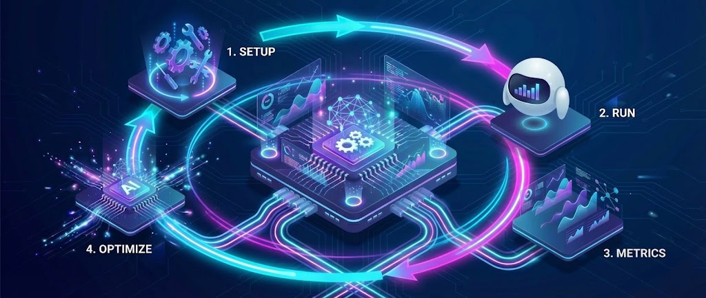

---
hide:
  - navigation
---

#

  

  <strong>The Comprehensive Ecosystem for ROS 2 Navigation & SLAM</strong>

[🚀 Quick Start](QUICK_START.md){ .md-button .md-button--primary }
[📊 Features & Metrics](METRICS.md){ .md-button }
[🌟 GitHub](https://github.com/guillaume-schneider/BenchBot){ .md-button }
{: align="center" }

---

## 💡 More Than a Benchmark

**BenchBot** is not just an evaluation tool—it is a **complete lifecycle ecosystem** for professional ROS 2 development. From initial integration to final validation, it empowers teams to master their navigation stack.

!!! abstract "The BenchBot Workflow"
    *   **🧩 Integrate**: Plug in any SLAM algorithm or Navigation stack with our modular plugin system.
    *   **⚙️ Optimize**: Use the **AI Auto-Tuner** to automatically discover the perfect parameters for your robot.
    *   **📈 Monitor**: Track evolution with industrial-grade metrics (**ATE**, **SSIM**, **Coverage**) over time.
    *   **✅ Validate**: Ensure production readiness with automated CI/CD pipelines and reproducible Docker environments.

---

## ⚡ Key Features

=== "🤖 For Researchers"
    *   **Automated Metrics**: Stop measuring by hand. Get ATE, RPE, SSD, and SSIM automatically.
    *   **Comparative Analysis**: Run 10 different SLAM configs and get a single PDF comparing them.
    *   **Reproducibility**: `config_resolved.yaml` guarantees your experiments are repeatable.

=== "🛠️ For Developers"
    *   **CI/CD Integration**: Run benchmarks in Headless mode on your Jenkins/GitHub Actions runners.
    *   **Modular Architecture**: Add your own SLAM algorithm or metric with a simple plugin system.
    *   **Rich API**: Full Python API for custom automations.

=== "📦 For Enterprise"
    *   **O3DE Support**: High-fidelity photorealistic simulations for client demos.
    *   **Hardware-in-the-Loop**: Calibrate sensor noise models to match your real robots.
    *   **Dockerized**: Deploy on any infrastructure without dependency hell.

=== "🧠 AI Auto-Tuner"
    *   **Bayesian Optimization**: Uses **Optuna** to find the perfect SLAM parameters automatically.
    *   **Hands-Free Tuning**: Define a search range (e.g., `particles: 30-100`) and let the AI maximize accuracy.
    *   **Objective-Driven**: Minimizes **ATE** (Trajectory Error) to guarantee the best possible localization.

---

## 📐 How It Works

  

---

## 📚 Documentation Map

### 🚀 Getting Started
- **[Installation Guide](INSTALLATION.md)**: Setup dependencies and run your first benchmark.
- **[Simulators](SIMULATORS.md)**: Choose between low-poly (Gazebo) and photorealistic (O3DE).
- **[Quick Reference](INSTALLATION.md)**: Fast links for common tasks.

### 🧠 Deep Dive
- **[Metrics Explained](METRICS.md)**: Understand ATE, SSIM, IoU, and more.
- **[Architecture](system_overview.md)**: Learn how the orchestrator works under the hood.
- **[Auto-Tuner](AUTO_TUNER_GUIDE.md)**: Use AI to optimize your SLAM parameters.

### 🔧 Operations
- **[Troubleshooting](TROUBLESHOOTING_EXPLORATION.md)**: Solutions for common navigation and mapping issues.
- **[Headless Mode](HEADLESS_CI.md)**: Running benchmarks on servers without a GUI.
- **[Multi-SLAM](MULTI_SLAM_GUIDE.md)**: How to add and compare new algorithms.

---

  <small>Maintained by the Guillaume Schneider • Version 1.0</small>

