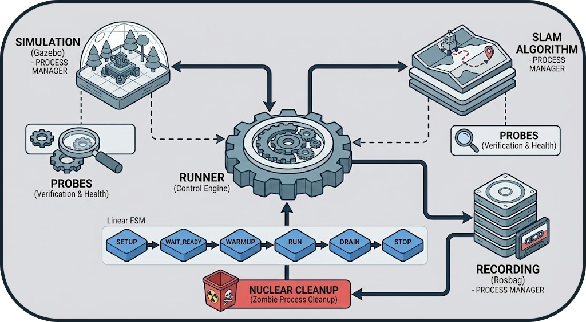
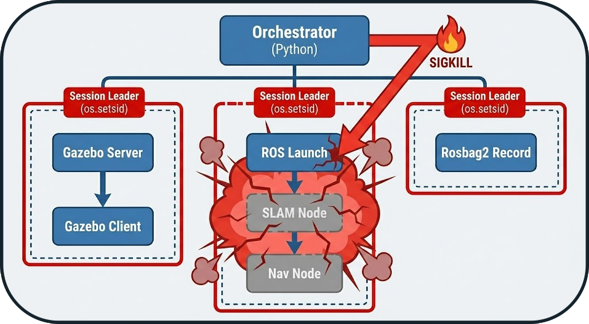
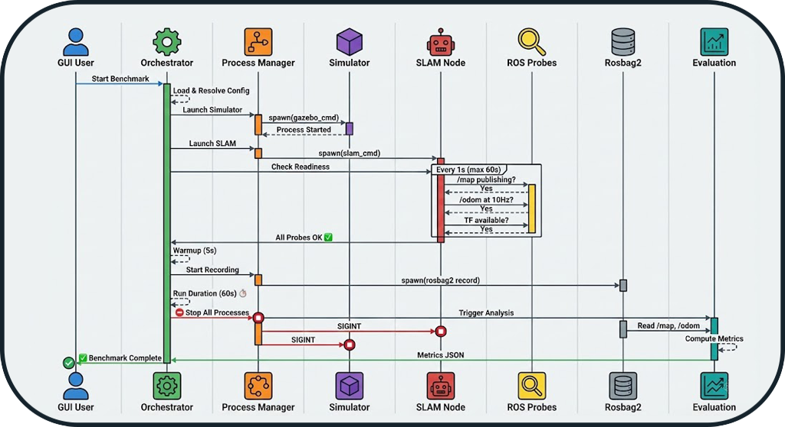

# Orchestrator

The **Orchestrator** is the heart of the BenchBot system. Unlike a simple sequential execution script, it is an engine based on a **Finite State Machine (FSM)** designed to ensure the stability and reproducibility of benchmarks.

It provides the interface between the configuration (user intent) and the actual execution (Simulators, ROS 2, SLAM).

---

## 1. Lifecycle (State Machine)

The Orchestrator follows a strict lifecycle to avoid race conditions and ensure that data is only recorded when the system is stable.



### State Details

| State | Description | Main Action |
|-------|-------------|-------------|
| **SETUP** | Environment preparation | Preventive cleanup of zombie processes (from previous runs). |
| **LAUNCH_SIM** | Simulator startup | Launching Gazebo or O3DE depending on configuration. |
| **LAUNCH_SLAM** | SLAM startup | Launching the SLAM node (cartographer, slam_toolbox, etc.). |
| **WAIT_READY** | Active waiting | Continuous verification of system health via ROS 2 Probes. |
| **WARMUP** | Warmup | Buffer period (5-10s) allowing SLAM to converge before recording starts. |
| **RUN** | Execution | Data recording (rosbag record) for the defined duration. |
| **DRAIN** | Graceful shutdown | Sending stop signals and waiting for process closure and disk writing. |
| **CLEANUP** | Final cleanup | Generation of partial metrics and release of resources. |

---

## 2. Reliability: The Probe System

Rather than using fixed waits (`sleep 10`), the orchestrator uses **active probes** to verify the actual state of the system. This allows the benchmark to start as soon as the system is ready, or fail quickly in case of issues.

!!! info "Why Probes?"
    A `sleep` is either **too short** (benchmark fails) or **too long** (wasted time). Probes guarantee **optimal timing**.

### Check Types

Probes are configurable in the YAML file and can check:

- **TopicPublish**: If a topic is publishing data (e.g., `/map`).
- **TopicHz**: If the publication frequency is sufficient (e.g., `/odom` > 10Hz).
- **TfProbe**: If the transform tree is complete (e.g., `map` → `base_link`).
- **ServiceProbe**: If a ROS service is available.
- **NodeProbe**: If a ROS 2 node is present.

### Configuration Example

```yaml
probes:
  ready:  # Executed before WARMUP
    - type: topic_publish
      topic: /map
      msg_type: nav_msgs/msg/OccupancyGrid
      timeout_s: 60
      
    - type: topic_hz
      topic: /odom
      msg_type: nav_msgs/msg/Odometry
      min_hz: 5.0
      timeout_s: 20
      
    - type: tf_available
      from_frame: map
      to_frame: base_link
      timeout_s: 30
```

**Guarantee**: The system only moves to the **WARMUP** phase if **all probes** are validated.

---

## 3. Process Management

The Orchestrator acts as a **robust supervisor** for external processes (Gazebo, Nav2, SLAM).

### Isolation (Process Groups)

To avoid orphan processes (zombies), each component is launched in its own **Process Group** (via `os.setsid`). This allows the orchestrator to kill not only the parent process but also all its children recursively.



### Shutdown Strategy (Graceful Shutdown)

At the end of a run, the orchestrator applies an **escalation strategy** to close processes:

1. **SIGINT** (Polite): Standard stop request (equivalent to Ctrl+C).
2. **SIGTERM** (Firm): If the process does not respond after 5s.
3. **SIGKILL** (Nuclear): Immediate destruction after 10s if totally blocked.

!!! warning "Zombie Processes"
    Without group isolation, a simulator like Gazebo can leave active `gzserver` processes that block network ports for subsequent runs.

---

## 4. Configuration Resolution

Before launching, the orchestrator compiles a unique configuration (`config_resolved.yaml`) by merging several layers according to a strict hierarchy:

1. **Defaults**: Base values.
2. **Dataset**: Environment specifics.
3. **SLAM Profile**: Algorithm parameters.
4. **Matrix Overrides**: Final user configuration (highest priority).


!!! success "Reproducibility"
    This approach guarantees that every run has a **unique and immutable "source of truth"**, allowing the exact same benchmark to be relaunched later.

### Merge Example

```yaml
# defaults.yaml
timeout: 60
warmup_duration: 5

# slam.yaml (cartographer)
slam:
  update_rate: 10.0
timeout: 120  # Override

# matrix.yaml
matrix:
  include:
    - slam: cartographer
      timeout: 180  # Final override

# ✅ Merged Result (config_resolved.yaml)
timeout: 180  # Matrix wins (highest priority)
warmup_duration: 5  # From defaults
slam:
  update_rate: 10.0  # From SLAM profile
```

---

## 5. Complete Execution Flow

### Benchmark Time Sequence



---

## Next Steps

- **[System Overview](system_overview.md)**: Architecture overview
- **[Evaluation Logic](evaluation_logic.md)**: Metrics details
- **[Tools](tools.md)**: Simulators and GT map generation
- **[API Reference](api/runner.md)**: Source code documentation
