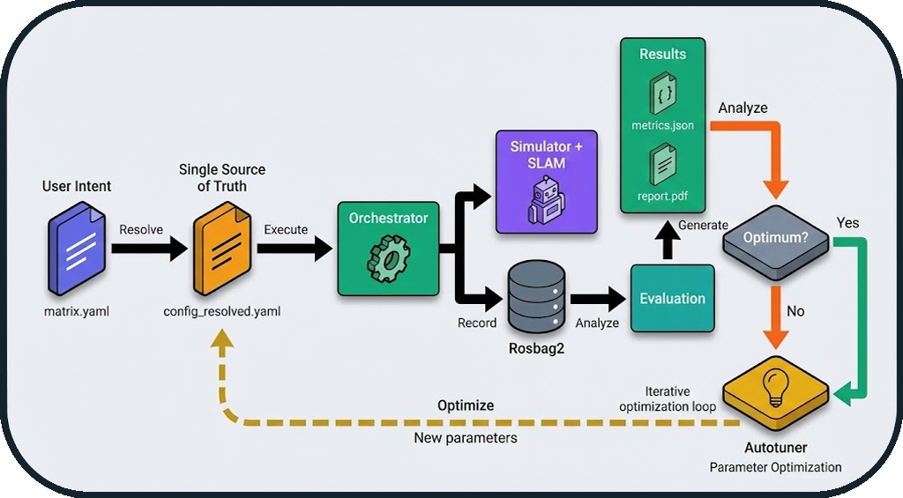

# System Overview

The **BenchBot** is designed as a modular system to automate, monitor, and evaluate SLAM algorithms in simulated environments. This document provides a high-level overview of the system's architecture and design principles.

## Modular Architecture

### Concept: Frontend/Backend Separation

The system is not monolithic but divided into **four independent pillars**. This strict separation allows the execution engine to run in **Headless** mode (without a graphical interface) for Continuous Integration (CI/CD), while the GUI acts merely as a remote control.

### The 4 Pillars

1. **Frontend (GUI)**: Visualization and user control (PyQt5)
2. **Backend (Runner)**: Orchestration and process management
3. **Evaluation**: Post-execution mathematical calculations
4. **Infrastructure/Tools**: Logging, report generation, simulator management


!!! note "Frontend/Backend Separation"
    The Frontend/Backend separation ensures that the system can operate without a graphical interface, which is essential for CI/CD pipelines and server environments.

---

## Design Patterns

The system uses several proven design patterns to ensure maintainability and extensibility:

### 1. State Machine (Orchestrator)

The orchestrator uses a **Finite State Machine** to manage the lifecycle of benchmarks deterministically.

**Advantage**: Ensures state transitions are controlled and data is only recorded when the system is stable.

### 2. Observer (Probes)

ROS 2 probes implement the Observer pattern to monitor the system status in real-time.

**Advantage**: Rapid problem detection and optimal startup (no fixed `sleep()`).

### 3. Adapter (Simulators)

Each simulator (Gazebo, O3DE) implements a common `BaseSimulator` interface.

**Advantage**: Adding a new simulator requires no modification to the orchestrator.

### 4. Strategy (Graceful Shutdown)

Process termination follows an escalation strategy (SIGINT → SIGTERM → SIGKILL).

**Advantage**: Clean process shutdown with fallback in case of hanging.

### 5. Deep Merge (Configuration)

Configuration resolution merges multiple layers according to a strict hierarchy.

**Advantage**: Full reproducibility with a single source of truth per run.

---

## Data Flow

### From Configuration File to Result



### Key Steps

1. **Configuration**: Hierarchical merging of YAML files
2. **Execution**: Orchestration via state machine
3. **Recording**: ROS 2 data capture (rosbag2)
4. **Evaluation**: Metric calculation (IoU, SSIM, ATE, etc.)
5. **Report**: PDF generation with visualizations

### Optimization Loop (Autotuner)

The diagram above also illustrates the **automatic optimization loop**:

**Iterative Workflow**:

1. After result generation, the system evaluates: **"Optimum reached?"**
2. **If No**: The autotuner analyzes metrics and proposes new parameters
3. **Automatic Return**: The new configuration is injected into `config_resolved.yaml`
4. **New Run**: The cycle restarts with optimized parameters
5. **If Yes**: The best configuration is saved (`config_optimized.yaml`)

!!! success "Zero-Touch Optimization"
    This loop allows for automatic optimization of SLAM parameters (resolution, frequency, thresholds) without manual intervention between runs. The system can thus explore the parameter space and converge towards the optimal configuration for a given environment.

**Example**: Map resolution optimization

- Run 1: resolution=0.05m → IoU=0.82
- Run 2: resolution=0.025m → IoU=0.88 ✅
- Run 3: resolution=0.01m → IoU=0.87 (degradation)
- **Result**: Optimum = 0.025m (best quality/performance trade-off)

---

## Typical User Workflow

### From Need to Analysis: A Complete Benchmark Journey

This section describes the typical journey of a user wishing to evaluate a SLAM algorithm.

#### Phase 1: Preparation (5-10 minutes)

**Objective**: Define what to test

**Actions**:
1. Choose an **environment** (dataset): `warehouse`, `office`, `maze`
2. Select a **SLAM algorithm**: `cartographer`, `slam_toolbox`, `rtabmap`
3. Optional: Configure **degradations** (sensor noise, limited range)

**Created File**: `matrix.yaml`

```yaml
matrix:
  include:
    - dataset: warehouse
      slam: cartographer
      degradation:
        enabled: true
        range_sensor:
          max_range: 8.0
          noise_std: 0.02
```

**Key Decision**: Which simulator to use?
- **Gazebo**: Fast, stable, well-documented (recommended for starting)
- **O3DE**: Realistic graphics, advanced physics (for visual tests)

#### Phase 2: Execution (2-5 minutes per run)

**Objective**: Launch the benchmark and collect data

**Actions**:
1. Launch via GUI: `python -m gui.main` → "Benchmark" Tab
2. Or via CLI: `python -m runner.orchestrator --config matrix.yaml`

**Typical Timeline**:
```
t=0s    : Environment cleanup + Config resolution
t=5s    : Simulator launch (Gazebo/O3DE)
t=15s   : SLAM launch + Navigation
t=20s   : Probe verification (topics, TF, services)
t=25s   : Warmup (initial SLAM convergence)
t=30s   : Start rosbag recording
t=90s   : End recording (duration: 60s)
t=95s   : Graceful shutdown (SIGINT → SIGTERM → SIGKILL)
t=100s  : Preliminary metrics generation
```

**Output**: Folder `results/runs/RUN_YYYYMMDD_HHMMSS/`
- `config_resolved.yaml`: Exact configuration used
- `rosbag2/`: Recorded ROS 2 data
- `logs/`: Detailed execution logs
- `metrics_partial.json`: System metrics (CPU, RAM)

#### Phase 3: Evaluation (30 seconds - 2 minutes)

**Objective**: Calculate quality metrics

**Actions**:
1. Automatic after run (if enabled)
2. Or manual: `python -m evaluation.metrics --run-dir results/runs/RUN_XXX`

**Calculated Metrics**:
- **IoU** (Intersection over Union): Global similarity with GT
- **SSIM** (Structural Similarity): Structural coherence
- **ATE** (Absolute Trajectory Error): Localization precision
- **Coverage**: Percentage of environment explored
- **Wall Thickness**: Quality of detected walls

**Output**: `metrics.json` with all metrics

#### Phase 4: Analysis (5-10 minutes)

**Objective**: Interpret results and compare

**Actions**:
1. Visualize in GUI: "Comparison" Tab
2. Generate PDF report: `python -m tools.report_generator`
3. Compare multiple runs: Automatic tables and charts

**Deliverables**:
- `report.pdf`: Professional report with visualizations
- Superimposed trajectory plots (GT vs SLAM)
- Comparative maps (difference heatmaps)
- Multi-run metric tables

### Advanced Use Cases

**Test Matrix**
```yaml
# Test 3 SLAM × 2 environments × 2 noise levels = 12 runs
matrix:
  include:
    - slam: [cartographer, slam_toolbox, rtabmap]
      dataset: [warehouse, office]
      degradation:
        enabled: [false, true]
```

**Result**: 12 automatic runs with global comparative report

**Parameter Optimization**
```yaml
# Test different map resolutions
matrix:
  include:
    - slam: cartographer
      slam_params:
        resolution: [0.025, 0.05, 0.1]
```

**Result**: Identify optimal resolution (quality/performance trade-off)

---

## System Guarantees

The BenchBot system offers several architectural guarantees:

| Guarantee | Description | Mechanism |
|-----------|-------------|-----------|
| **Reproducibility** | Two identical runs produce the same results | Immutable configuration (`config_resolved.yaml`) |
| **Robustness** | No zombie processes | Isolation by groups (`os.setsid`) |
| **Traceability** | Complete logs for every run | Centralized logger + crash reports |
| **Flexibility** | Multi-simulator support | Adapter Pattern |
| **Reliability** | Optimal startup | Active probes (vs `sleep()`) |

---

## Next Steps

To deepen your understanding:

- **[Orchestrator Architecture](orchestrator_architecture.md)**: State machine and probes details
- **[Evaluation Logic](evaluation_logic.md)**: Metrics (IoU, SSIM, ATE, Coverage)
- **[Tools](tools.md)**: Simulators, GT map generation, PDF reports
- **[API Reference](api/runner.md)**: Source code documentation
