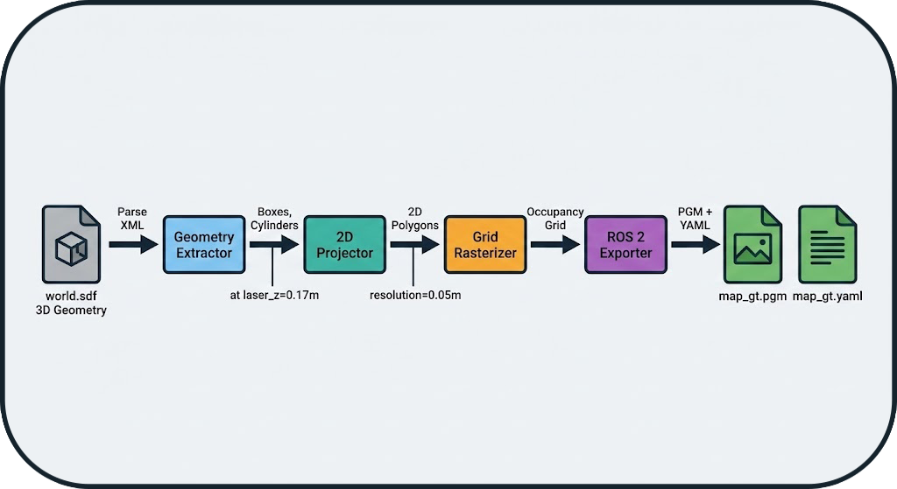

# Tools & Infrastructure

This document describes the tools and infrastructure components that support the BenchBot system.

---

## 1. Simulator Manager (Adapter Pattern)

### Concept: Unified Interface

The system supports **Gazebo** and **O3DE** via the **Adapter** pattern. Each simulator implements the `BaseSimulator` interface, ensuring that the orchestrator does not need to know implementation details.


!!! success "Extensibility"
    Adding a new simulator (e.g., Isaac Sim, Webots) only requires implementing a new Adapter, without modifying the orchestrator.

### Supported Simulators

| Simulator | Status | Description |
|-----------|--------|-------------|
| **Gazebo Classic** | ✅ Supported | Historic ROS simulator, stable and proven |
| **O3DE** | ✅ Supported | Modern 3D engine with realistic physics |

---

## 2. Ground Truth Map Generation

### Concept: Virtual Laser Slicing

The system generates the Ground Truth (GT) map **without using SLAM**, ensuring no bias. The `gt_map.generator` module performs a **virtual laser slice** of the SDF (Simulation Description Format) file.

### Generation Pipeline

1. **XML Parsing**: Extraction of 3D geometries (boxes, cylinders) from the SDF
2. **2D Projection**: Horizontal slice at laser height (e.g., 0.17m)
3. **Rasterization**: Conversion to occupancy grid (configurable resolution)
4. **ROS 2 Export**: Generation of PGM + YAML files compatible with `map_server`



!!! note "Zero-Bias Guarantee"
    The GT map is purely analytical, derived from the geometry of the simulated world, without any influence from a SLAM algorithm.

!!! info "Automatic Generation"
    For SLAM benchmarks, the GT map is **automatically generated** at the start of each run if it does not already exist in the dataset directory. This ensures that each environment has its reference map without manual intervention.

### Usage Example

```bash
# Generate a GT map from an SDF file
python -m gt_map.generator \
    --sdf worlds/warehouse.sdf \
    --resolution 0.05 \
    --laser-z 0.17 \
    --output maps/warehouse_gt
```

**Result**:
- `maps/warehouse_gt.pgm`: Map image (black = occupied, white = free)
- `maps/warehouse_gt.yaml`: ROS 2 metadata (resolution, origin, etc.)

---

## 3. PDF Report Generator

### Features

The PDF report generator (`tools/report_generator.py`) creates professional reports with:

- **Aggregated Metrics**: Comparative multi-run tables
- **Visualizations**: Trajectory plots, maps, time-series metrics
- **Statistics**: Means, standard deviations, min/max
- **Metadata**: Configuration, duration, system resources

### Report Structure

```
📄 benchmark_report.pdf
├── 📊 Executive Summary
│   ├── Runs Overview Table
│   └── Key Metrics Comparison
├── 📈 Detailed Results
│   ├── Run 1: cartographer_warehouse
│   │   ├── Trajectory Overlay
│   │   ├── Map Comparison (GT vs SLAM)
│   │   └── Metrics Breakdown
│   ├── Run 2: slam_toolbox_warehouse
│   └── ...
└── 📋 Appendix
    ├── Configuration Files
    └── System Information
```

### Usage Example

```python
from tools.report_generator import SLAMReportGenerator

# Load results from multiple runs
runs_data = [
    load_run_results("results/runs/RUN_001"),
    load_run_results("results/runs/RUN_002"),
]

# Generate the report
generator = SLAMReportGenerator(runs_data, "reports/comparison.pdf")
generator.generate()
```

---

## 4. Centralized Logger

### Architecture

The centralized logging system (`utils/logger.py`) provides:

- **Automatic Context**: Module name, timestamp, level
- **File Rotation**: Logs automatically archived
- **Crash Reports**: Stacktraces saved in case of error
- **Filtering**: Configurable levels (DEBUG, INFO, WARNING, ERROR)

### Usage Example

```python
from utils.logger import get_logger

logger = get_logger("my_module")

logger.info("Benchmark started")
logger.warning("High CPU usage detected: 95%")
logger.error("SLAM node crashed", exc_info=True)
```

**Output**:
```
[2026-01-08 15:30:45] [INFO] [my_module] Benchmark started
[2026-01-08 15:31:12] [WARNING] [my_module] High CPU usage detected: 95%
[2026-01-08 15:31:45] [ERROR] [my_module] SLAM node crashed
Traceback (most recent call last):
  ...
```

### Crash Reports

In the event of an unhandled exception, the system automatically generates a crash report in `logs/crashes/` with:

- Full stacktrace
- Local variables
- System state (CPU, RAM, active processes)
- Run configuration

---

## 5. Dependency Manager

### Concept

The dependency manager (`runner/dependency_manager.py`) automates the management of ROS 2 packages required by SLAM algorithms.

### Features

1. **Verification**: Detects if a package is installed
2. **Automatic Download**: Clones Git repositories if the package is not available
3. **Automatic Installation**: Compiles and installs packages from source
4. **Automatic Sourcing**: Generates necessary `source` commands
5. **Wrapping**: Injects dependencies into launch commands

!!! info "Automatic Installation from Git"
    The system can automatically download and install ROS 2 packages from Git repositories if specified in the configuration. This ensures that all dependencies are available without manual intervention.

### Example

```yaml
# SLAM Configuration
slam:
  id: cartographer
  dependencies:
    - cartographer_ros
    - nav2_bringup
```

**Result**: The orchestrator automatically wraps the launch command:

```bash
# Before
ros2 launch cartographer_ros cartographer.launch.py

# After (automatic)
bash -c "source /opt/ros/humble/setup.bash && \
         source ~/cartographer_ws/install/setup.bash && \
         exec ros2 launch cartographer_ros cartographer.launch.py"
```

---

## 6. Advanced Features

### Autotuner: Automatic Parameter Optimization

The **Autotuner** is an automatic optimization module that explores the parameter space of a SLAM algorithm to find the optimal configuration for a given environment.

#### Concept

Instead of manually testing different parameter values, the autotuner uses optimization algorithms (Grid Search, Random Search, Bayesian Optimization) to automatically identify the best settings.

#### Workflow


!!! info "Integration into Workflow Loop"
    The autotuner is an integral part of the BenchBot workflow loop. **At the end of each run**, the system can automatically:

    1. Analyze the obtained metrics (IoU, SSIM, ATE, etc.)
    2. Use these results to guide parameter exploration
    3. Propose a new optimized configuration
    4. Automatically launch the next run

    This **iterative and automatic** approach allows for parameter optimization without manual intervention between runs.

#### Configuration Example

```yaml
autotuner:
  enabled: true
  algorithm: bayesian_optimization  # grid_search, random_search, bayesian_optimization
  target_metric: iou  # Metric to maximize
  max_iterations: 20
  
  parameters:
    # Map resolution
    - name: slam.resolution
      type: float
      range: [0.025, 0.1]
      
    # Update rate
    - name: slam.update_rate
      type: int
      range: [5, 20]
      
    # Occupancy threshold
    - name: slam.occupancy_threshold
      type: float
      range: [0.5, 0.8]
```

#### Result

After 20 iterations, the autotuner generates:
- **Best Configuration**: `config_optimized.yaml`
- **Optimization History**: Convergence plot
- **Comparative Report**: Before/after optimization

**Typical Gain**: +15% to +30% on key metrics (IoU, SSIM)

---

### Hardware Degradations: Real-World Simulation

The system allows simulating **hardware degradations** to test the robustness of SLAM algorithms in non-ideal conditions.

#### Degradation Types

##### 1. Sensor Noise

Simulates the inaccuracy of real sensors (LiDAR, cameras).

```yaml
degradation:
  enabled: true
  range_sensor:
    noise_std: 0.02  # Standard deviation of Gaussian noise (meters)
    noise_type: gaussian  # gaussian, uniform, salt_pepper
```

**Impact**: Noisy measurement points → less accurate map

##### 2. Range Limitation

Simulates a sensor with reduced maximum range.

```yaml
degradation:
  enabled: true
  range_sensor:
    max_range: 8.0  # Max range (meters, vs 30m nominal)
    min_range: 0.5  # Min range
```

**Impact**: Unobserved areas → reduced coverage

##### 3. Frequency Scaling

Simulates a sensor with reduced acquisition frequency.

```yaml
degradation:
  enabled: true
  range_sensor:
    frequency_scale: 0.5  # 50% of nominal frequency (e.g., 5Hz instead of 10Hz)
```

**Impact**: Fewer data → less accurate localization

##### 4. Speed Scaling

Simulates a slower robot (useful for testing convergence).

```yaml
degradation:
  enabled: true
  robot:
    speed_scale: 0.7  # 70% of nominal speed
```

**Impact**: Longer exploration time → different convergence

##### 5. Dynamic Occlusions

Simulates moving obstacles that temporarily block the sensor.

```yaml
degradation:
  enabled: true
  occlusions:
    enabled: true
    frequency: 0.1  # Probability of occlusion per second
    duration: 2.0   # Average duration of an occlusion (seconds)
```

**Impact**: Temporary data loss → robustness tested

#### Complete Example: Realistic Scenario

```yaml
# Simulating a low-cost robot in a dusty warehouse
degradation:
  enabled: true
  range_sensor:
    noise_std: 0.05        # Low-end sensor
    max_range: 10.0        # Limited range
    frequency_scale: 0.6   # Reduced frequency (energy saving)
  robot:
    speed_scale: 0.8       # Slower robot (safety)
  occlusions:
    enabled: true
    frequency: 0.05        # Moving obstacles (forklifts, people)
    duration: 1.5
```

**Utility**: Validate that a SLAM algorithm works in real-world conditions, not just in perfect simulation.

#### Use Cases

**Robustness Comparison**
```yaml
matrix:
  include:
    - slam: [cartographer, slam_toolbox, rtabmap]
      degradation:
        enabled: [false, true]  # With and without degradations
```

**Result**: Identify which SLAM is most robust to degraded conditions.

**Threshold Calibration**
```yaml
# Find the maximum acceptable noise level
matrix:
  include:
    - slam: cartographer
      degradation:
        range_sensor:
          noise_std: [0.01, 0.02, 0.05, 0.1]
```

**Result**: Determine at which noise level performance drops.

---

## Next Steps

- **[System Overview](system_overview.md)**: Architecture overview
- **[Orchestrator Architecture](orchestrator_architecture.md)**: State machine and probes
- **[Evaluation Logic](evaluation_logic.md)**: Metrics and calculations
- **[API Reference](api/tools.md)**: Code documentation
